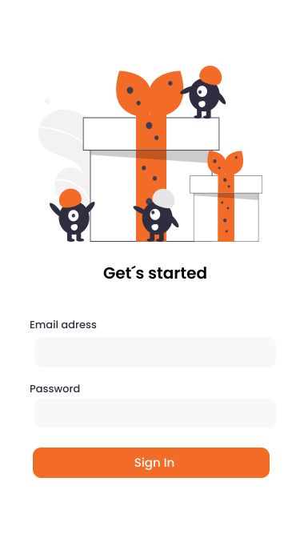
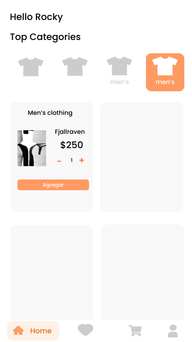
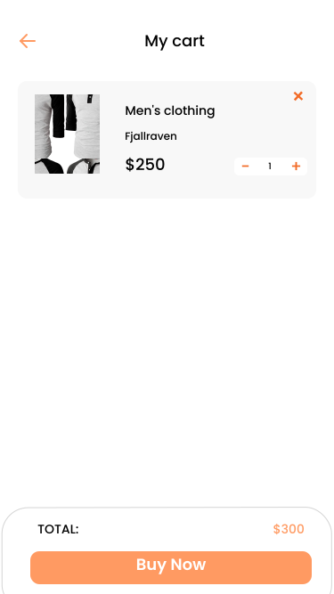
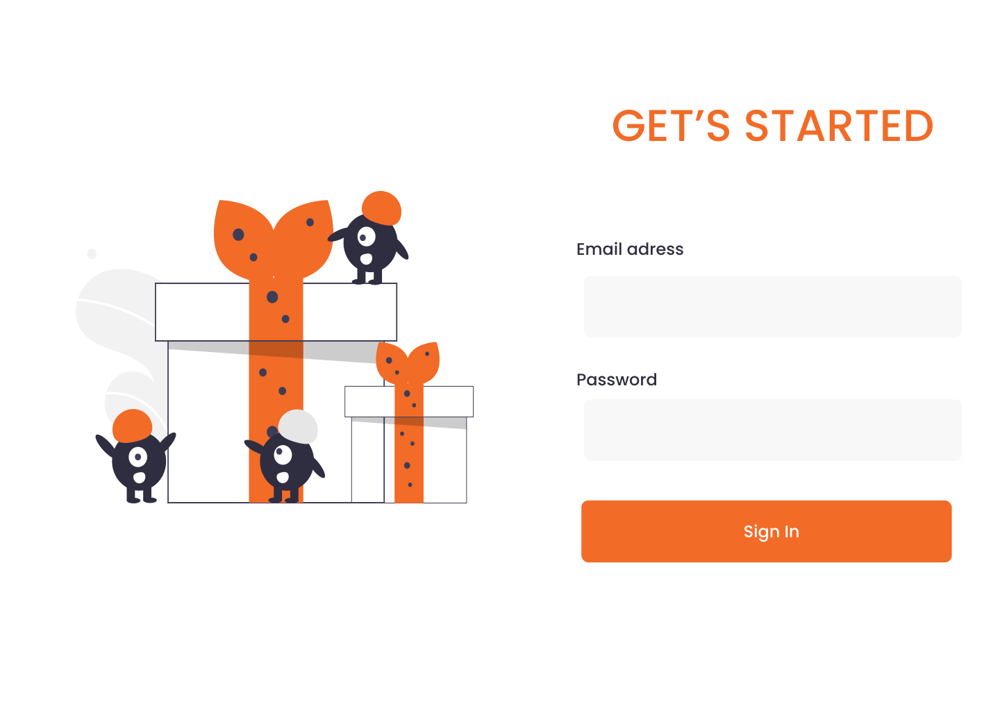
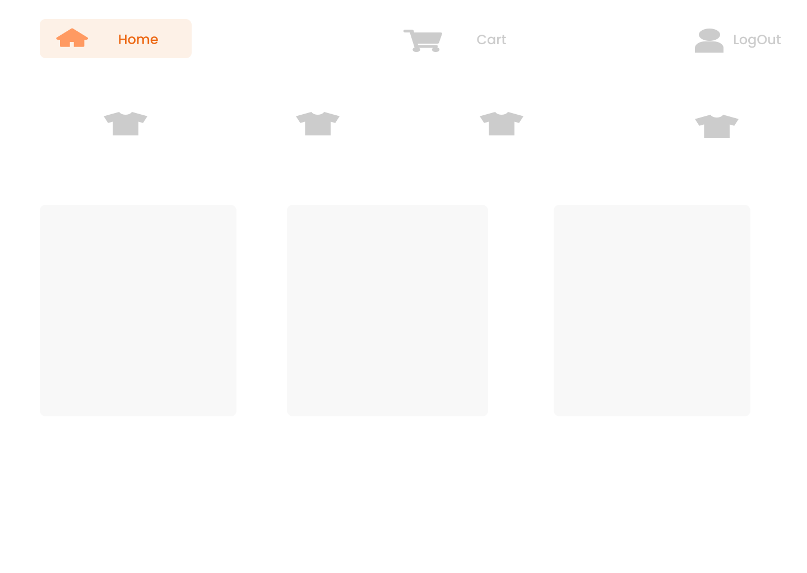

# APP ECOMMERCE: Welcome to the page!

## Índice

* [1. Resumen](#1-resumen)
* [2. Historias de Usuario](#2-historias-de-usuario)
* [3. Prototipado](#3-prototipado)

***

## 1. Resumen

La lógica del proyecto esta implementada completamente en TypeScript, HTML y CSS y empaquetada de manera automatizada en el framework Angular 12. Utilizando datos de una API.
La aplicación es un Single Page App. Mobile First
- username: mor_2314
- password: 83r5^_

## 2. Historias de usuario

Historia de usuario 1: Usuario que desea observar los productos
Yo como usuario con cuenta quiero logearme en la página para poder ver los productos

*Criterios de aceptación
- Entar con cuenta creada
- Se ve bien en mobile

Historia de usuario 2: Usuario que desea filtrar y añadir productos al carrito
Yo como usuario quiero poder filtrar los productos por categoria para poder encontrarlos mas rápido y asi añadirlos al carrito de compras

*Criterios de aceptación
- Filtra por categoria
- Añade productos al carrito
- Se ve bien en mobile

Historia de usuario 2: Usuario que desea aumentar, disminuir y eliminar productos del carrito de compras
Yo como usuario quiero poder filtrar los productos por categoria para poder encontrarlos mas rápido y asi añadirlos al carrito de compras

*Criterios de aceptación
- Añade productos con el boton +
- Disminuye productos con el boton -
- Elimina productos con el boton x
- Puede ver el total de los productos
- La data del carrito tiene persistencia
- Se ve bien en mobile

## 3. Prototipo de alta fidelidad
Se realizó el prototipado(mobile y dekstop) en Figma

*Vista mobile:

*Vista Dekstop:

